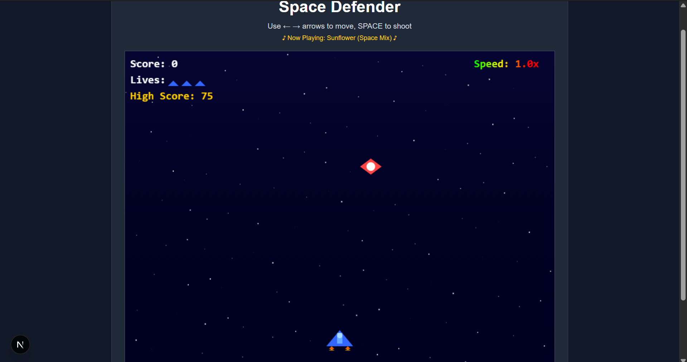

# 🚀 Space Defender

A modern, browser-based space shooter game built with Next.js and TypeScript. Defend Earth from alien invaders in this action-packed arcade-style game!



## 🎮 Game Features

- **Dynamic Gameplay**: Progressive difficulty scaling as your score increases
- **Multiple Enemy Types**: Different enemy ships with unique behaviors and point values
- **Smooth Controls**: Intuitive keyboard controls for movement and shooting
- **Visual Effects**:
  - Particle explosions
  - Dynamic starfield background
  - Animated ship engines
  - Smooth animations
- **Audio Experience**:
  - Background music (Sunflower by Post Malone & Swae Lee)
  - Sound effects for shooting, explosions, and engine
  - Adjustable music and SFX volume
- **Score System**:
  - Real-time score tracking
  - High score persistence
  - Lives system
- **Responsive Design**: Clean, modern UI that works across different screen sizes

## 🛠️ Technologies Used

- **Frontend Framework**: Next.js 14
- **Language**: TypeScript
- **Styling**:
  - Tailwind CSS
  - Shadcn UI Components
- **Game Development**:
  - HTML5 Canvas for rendering
  - Web Audio API for sound
- **Development Tools**:
  - ESLint for code quality
  - TypeScript for type safety
  - PostCSS for CSS processing

## 🚀 Getting Started

### Prerequisites

- Node.js 18.0 or later
- npm or pnpm package manager

### Installation

1. Clone the repository:

   ```bash
   git clone https://github.com/yourusername/shooting-arcade.git
   cd space-defender
   ```

2. Install dependencies:

   ```bash
   npm install
   # or
   pnpm install
   ```

3. Start the development server:

   ```bash
   npm run dev
   # or
   pnpm dev
   ```

4. Open [http://localhost:3000](http://localhost:3000) in your browser

## 🎯 How to Play

- Use **Left** and **Right** arrow keys to move your spaceship
- Press **Space** to shoot
- Destroy enemy ships to earn points
- Avoid collisions with enemy ships
- Game speed increases as your score grows
- Try to achieve the highest score possible!

## 🎨 Game Controls

- **← →**: Move spaceship left/right
- **Space**: Shoot
- **Audio Button**: Toggle sound on/off
- **Music Slider**: Adjust background music volume
- **SFX Slider**: Adjust sound effects volume

## 🏆 Scoring System

- Small Enemy Ships: 10 points
- Medium Enemy Ships: 20 points
- Fast Enemy Ships: 15 points
- High scores are saved between sessions

## 🤝 Contributing

Contributions are welcome! Please feel free to submit a Pull Request.

## 📝 License

This project is licensed under the MIT License - see the [LICENSE](LICENSE) file for details.

## 🙏 Acknowledgments

- Background music: "Sunflower" by Post Malone & Swae Lee
- Inspired by classic arcade space shooters
- Built with modern web technologies
